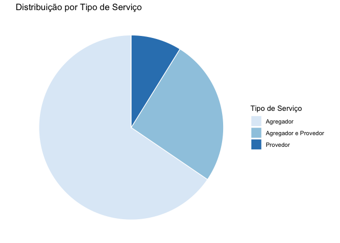
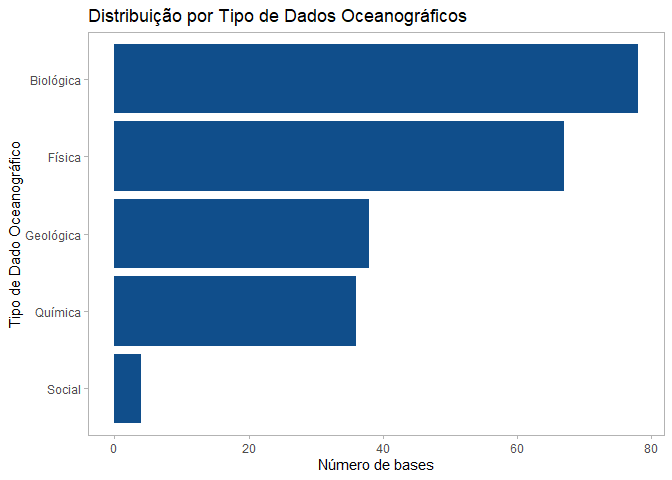
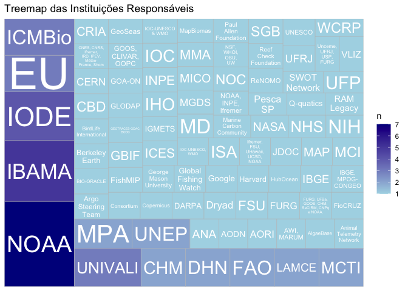
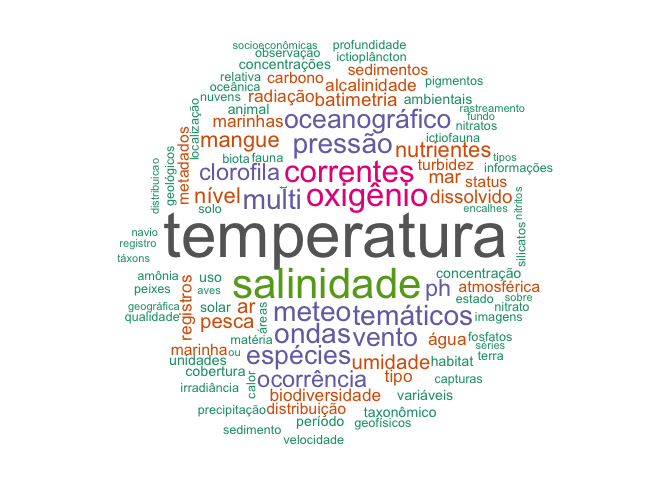
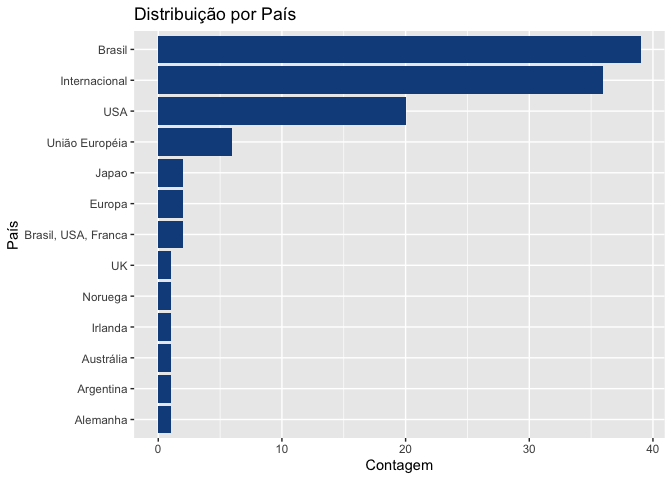
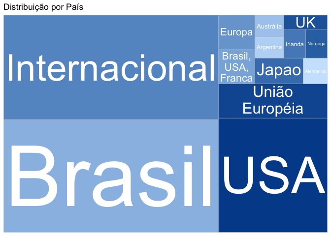

Levantamento de Bases de Dados
================

## Introdução

Este relatório apresenta uma análise exploratória das bases de dados
oceânicas e ambientais catalogadas para o Oceano Atlântico Sul e
Tropical, com foco em padrões de tipo de serviço, disponibilidade,
interoperabilidade e cobertura geográfica.

## Métodos

Métodos

O levantamento das bases de dados oceânicas e ambientais foi realizado
utilizando uma combinação de metodologias para garantir abrangência,
qualidade e reprodutibilidade dos dados:

1.  Levantamento bibliográfico

Foram consultados artigos científicos e revisões que tratam de bancos de
dados relevantes para oceanografia e ciências ambientais.

O objetivo foi identificar repositórios utilizados na prática pelos
pesquisadores.

Todas as referências bibliográficas utilizadas serão incluídas ao final
do relatório.

2.  Consulta a especialistas

Realizamos entrevistas e consultas com especialistas da área.

Utilizamos a metodologia de bola de neve, na qual os especialistas
indicavam outros pesquisadores para expandir a lista de bases e
referências relevantes.

3.  Questionário para a comunidade científica

Desenvolvemos um questionário para entender:

Quais repositórios os pesquisadores usam para disponibilizar seus dados.

Quais repositórios utilizam para realizar suas análises e pesquisas.

O questionário foi inicialmente distribuído a um grupo restrito de
especialistas e, gradualmente, disponibilizado publicamente para a
comunidade científica.

4.  Catalogação e harmonização das bases de dados

Todas as informações coletadas foram organizadas em uma planilha única
(bases.csv) contendo colunas padronizadas, descritas na Tabela 1:

### Tabela 1 – Cabeçalhos da base de dados e possíveis valores

| Cabeçalho                                  | Descrição                                                                | Possíveis valores / Observações                |
|--------------------------------------------|--------------------------------------------------------------------------|------------------------------------------------|
| Sigla                                      | Sigla ou código da base de dados                                         | Texto livre                                    |
| Nome Completo                              | Nome completo da base                                                    | Texto livre                                    |
| Tipo de Serviço                            | Tipo de serviço fornecido pela base                                      | Ex: Agregador, Portal, Catálogo                |
| Estado Operacional                         | Situação atual da base                                                   | Ativo, Em Implementação, Desativado            |
| Dados em Tempo Real (Operacional)          | Disponibilidade de dados em tempo real                                   | Sim / Não / Parcial                            |
| Dados Abertos                              | Disponibilidade de dados abertos                                         | Sim / Não                                      |
| Comentário disponibilidade de dados        | Observações adicionais                                                   | Texto livre                                    |
| API                                        | Disponibilidade de API                                                   | Sim / Não / Parcial                            |
| Comentário API                             | Observações sobre a API                                                  | Texto livre                                    |
| Tipo de Interface                          | Interface de acesso aos dados                                            | Ex: Portal Web, WMS/WFS, FTP, API              |
| Tipo de Acesso                             | Forma de acesso aos dados                                                | Ex: Download direto, Consulta via API          |
| Descrição da Base de Dados                 | Breve descrição do conteúdo                                              | Texto livre                                    |
| Tipo de Dados Oceanográficos               | Categorias da Oceanografia às quais os dados de um repositório pertencem | Física, Química, Geológica, Biológica, Sociais |
| Exemplos de dados disponíveis              | Exemplos de variáveis ou medições                                        | Texto livre (não harmonizado)                  |
| Instituição responsável pela base de dados | Organização responsável                                                  | Texto livre                                    |
| Cobertura Dados                            | Cobertura espacial ou temática                                           | Local, Regional, Global                        |
| País                                       | País da instituição                                                      | Texto livre                                    |
| Link                                       | URL de acesso                                                            | URL                                            |
| Observações                                | Comentários adicionais                                                   | Texto livre                                    |
| Protocolos de Interoperabilidade           | Protocolos suportados                                                    | Ex: WMS, WFS, OPeNDAP                          |
| Contato responsável pelos dados            | Pessoa ou e-mail de contato                                              | Texto livre                                    |
| Tipo de licença de uso                     | Licença ou restrição                                                     | Ex: CC-BY, Restrito, Público                   |

5.  Critérios de inclusão das bases

Para garantir consistência e relevância, aplicamos os seguintes
critérios na seleção das bases de dados:

- Cobertura espacial: somente bases com cobertura de dados no regiao
  costeira do Brasil ou no Oceano Atlantico Sul e Tropical foram
  incluidas.

- Disponibilidade online: apenas bases acessíveis pela internet foram
  incluídas.

- Catálogos de bases: incluímos catálogos apenas quando continham links
  válidos para outras bases com dados efetivos.

- Bases em implementação: incluímos bases em desenvolvimento apenas se
  apresentavam dados de teste ou estavam previstas para disponibilização
  nos próximos seis meses.

- Atualização e manutenção: bases com histórico de atualização ou
  manutenção regular foram priorizadas.

- Redundância e duplicidade: evitamos incluir múltiplas bases que
  fornecem exatamente os mesmos dados sem valor agregado.

## Resultados

``` r
# Carregar bibliotecas
library(tidyverse)
```

    ── Attaching core tidyverse packages ──────────────────────── tidyverse 2.0.0 ──
    ✔ dplyr     1.1.3     ✔ readr     2.1.5
    ✔ forcats   1.0.0     ✔ stringr   1.5.0
    ✔ ggplot2   3.5.0     ✔ tibble    3.2.1
    ✔ lubridate 1.9.3     ✔ tidyr     1.3.0
    ✔ purrr     1.0.2     
    ── Conflicts ────────────────────────────────────────── tidyverse_conflicts() ──
    ✖ dplyr::filter() masks stats::filter()
    ✖ dplyr::lag()    masks stats::lag()
    ℹ Use the conflicted package (<http://conflicted.r-lib.org/>) to force all conflicts to become errors

``` r
library(janitor)
```

    Warning: package 'janitor' was built under R version 4.3.3


    Attaching package: 'janitor'

    The following objects are masked from 'package:stats':

        chisq.test, fisher.test

``` r
library(tidytext)
library(wordcloud)
```

    Warning: package 'wordcloud' was built under R version 4.3.3

    Loading required package: RColorBrewer

``` r
library(ggplot2)
library(treemapify)

# Carregar dados
dados <- read_csv("../Dados/Bases.csv", show_col_types = FALSE) |> clean_names()

# Tratar colunas com múltiplas respostas
dados_long <- dados |> 
  separate_rows(tipo_de_dados_oceanograficos, sep = ";|,") |> 
  separate_rows(tipo_de_interface, sep = ";|,") |> 
  separate_rows(tipo_de_acesso, sep = ";|,")
```

### Distribuição por Tipo de Serviço

``` r
dados %>%
  count(tipo_de_servico, sort = TRUE) %>%
  ggplot(aes(x = "", y = n, fill = tipo_de_servico)) +
  geom_col(width = 1, color = "white") +
  coord_polar(theta = "y") +
  labs(fill = "Tipo de Serviço", title = "Distribuição por Tipo de Serviço") +
  theme_void()
```



``` r
# Contagem e porcentagem por Tipo de Serviço

tipo_servico_pct <- dados |>
count(tipo_de_servico) |>
mutate(pct = n / sum(n) * 100)
```

O tipo de serviço mais comum é **Agregador**, com 65.5% das bases.

### Distribuição por Tipo de Dados Oceanográficos

``` r
library(stringr)

dados_oceanograficos <- dados_long |>
select(sigla, tipo_de_dados_oceanograficos) |>
mutate(tipo_de_dados_oceanograficos = str_trim(tipo_de_dados_oceanograficos),   # remove espaços
tipo_de_dados_oceanograficos = str_to_title(tipo_de_dados_oceanograficos)) |> # padroniza maiúsculas
distinct() |>  # remove duplicatas
filter(!is.na(tipo_de_dados_oceanograficos))

# Contagem por categoria

dados_oceanograficos |>
count(tipo_de_dados_oceanograficos, sort = TRUE) |>
ggplot(aes(x = reorder(tipo_de_dados_oceanograficos, n), y = n)) +
geom_col(fill = "darkcyan") +
coord_flip() +
labs(x = "Tipo de Dado Oceanográfico", y = "Número de bases",
title = "Distribuição por Tipo de Dados Oceanográficos")
```



### Instituições Responsáveis

``` r
library(treemapify)
library(ggplot2)
library(scales)
```


    Attaching package: 'scales'

    The following object is masked from 'package:purrr':

        discard

    The following object is masked from 'package:readr':

        col_factor

``` r
dados_instituicoes <- dados |> 
  count(instituicao_responsavel_pela_base_de_dados, sort = TRUE) |> 
  filter(!is.na(instituicao_responsavel_pela_base_de_dados))

ggplot(dados_instituicoes, aes(area = n, fill = n, label = instituicao_responsavel_pela_base_de_dados)) +
  geom_treemap() +
  geom_treemap_text(
    aes(label = instituicao_responsavel_pela_base_de_dados),
    colour = "white",
    place = "centre",
    grow = TRUE,
    reflow = TRUE,
    min.size = 2  # garante que textos muito pequenos não sejam exibidos
  ) +
  scale_fill_gradient(low = "lightblue", high = "darkblue") +
  labs(title = "Treemap das Instituições Responsáveis")
```



### Exemplos de Dados Disponíveis

``` r
library(tidytext)
library(dplyr)
library(stringr)
library(wordcloud)
library(RColorBrewer)

# Stop words em português + palavras irrelevantes

stopwords_pt <- c(
"de", "da", "do", "em", "para", "com", "e", "a", "o", "os", "as", "dados", "dado", 
"no", "na", "nos", "nas", "por", "um", "uma", "uns", "umas",
"são", "etc", "co", "como"
)

# Preparar dados

exemplos <- dados |>
select(exemplos_de_dados_disponiveis) |>
unnest_tokens(palavra, exemplos_de_dados_disponiveis) |>
mutate(palavra = str_to_lower(palavra)) |>  # minúsculas
filter(!palavra %in% stopwords_pt) |>      # remover stopwords
filter(!str_detect(palavra, "^[0-9]+$")) |> # remover números
count(palavra, sort = TRUE)

# Nuvem de palavras

wordcloud(
words = exemplos$palavra,
freq = exemplos$n,
max.words = 100,
min.freq = 2,
scale = c(4,0.5),
random.order = FALSE,
colors = brewer.pal(8, "Dark2")
)
```



### Distribuição por País

``` r
dados |>
count(pais, sort = TRUE) |>
ggplot(aes(x = reorder(pais, n), y = n)) +
geom_col(fill = "dodgerblue4") +
coord_flip() +
labs(x = "País", y = "Contagem", title = "Distribuição por País")
```



``` r
library(dplyr)
library(treemapify)
library(ggplot2)

dados %>% 
  count(pais, sort = TRUE) %>% 
  ggplot(aes(
    area = n,
    fill = pais,
    label = pais        # <-- sem números
  )) +
  geom_treemap() +
  geom_treemap_text(
    place = "centre",
    grow = TRUE,
    reflow = TRUE,
    colour = "white",
    min.size = 3
  ) +
  scale_fill_manual(
    values = colorRampPalette(c("#cce5ff", "#004c99"))(length(unique(dados$pais)))
  ) +
  labs(title = "Distribuição por País") +
  theme(legend.position = "none")
```


